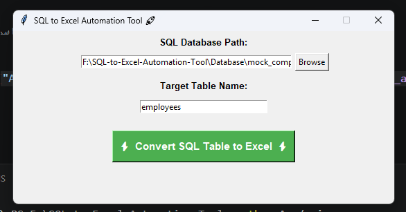

# 🚀 SQL to Excel Data Pipeline Automation Tool

## 📌 Project Overview
A production-ready Data Engineering and Automation utility written in Python. This desktop application simplifies the extraction of tabular structured data from SQL relational databases and automates the transformation and export pipeline directly into fully formatted Microsoft Excel spreadsheets, eliminating manual querying for non-technical business users.

## 💻 Desktop Application Interface
Here is a preview of the interactive GUI built with Tkinter, featuring integrated cross-language exception logging:



---

## 🛠️ Core Features & Engineering Deliverables
* **Dynamic Relational Connections:** Robust pipeline integration utilizing SQLite connections to query target structured schemas.
* **Efficient Pandas DataFrame Processing:** Sub-second operational data manipulation converting standard relational data readers into scalable memory tables.
* **Automated File Serialization:** Instant formatting output utilizing the `openpyxl` serialization engine.
* **Dynamic Time-Stamping Pattern:** Programmatic file-naming convention injects exact UNIX-based temporal stamps (`YYYYMMDD_HHMMSS`) preventing directory duplication or runtime overwriting.
* ** cross-Platform Path Architecture:** Absolute modular pathing via Python's `os` utility, guaranteeing static directory alignment across Windows, macOS, and Linux servers.

## ⚙️ Project Structure & Execution
To deploy or run the utility locally, structure your environment as follows:
```text
SQL-to-Excel-Automation-Tool/
├── App/
│   ├── exporter.py  # Core data processing pipeline & mock DB generation
│   └── gui.py       # Desktop Graphical User Interface
└── Database/        # Stores local target SQL relational engine files
```

To initialize the app pipeline:
```bash
pip install pandas openpyxl
python App/gui.py
```

